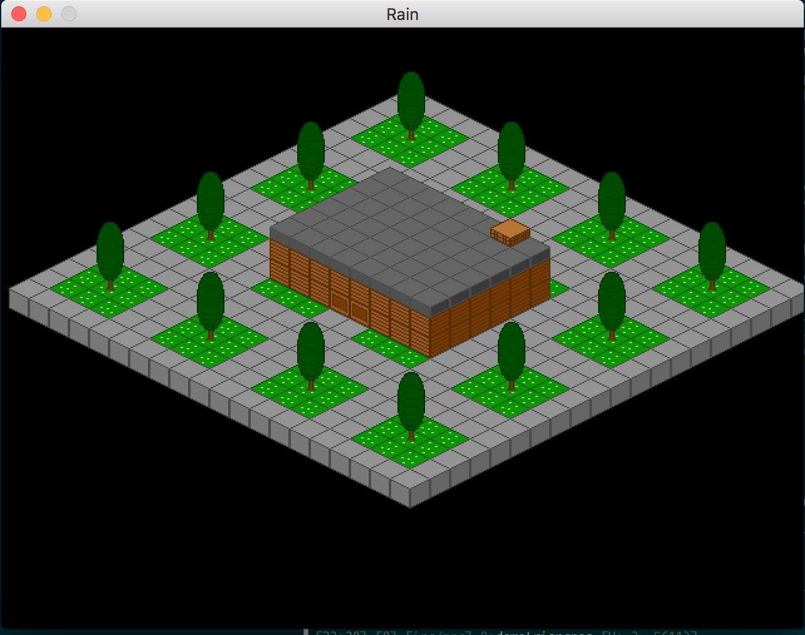

# Rain
An noire isometric strategy game

Rain's build script is currently setup to
build on OSX El Capitan.

* Requires SDL2 and SDL2_image

# Controls
* click to select character and click again to set path destination
* 1, 2, 3 for 1x, 2x, 3x zoom
* q and e to rotate screen
* arrow keys to move camera

