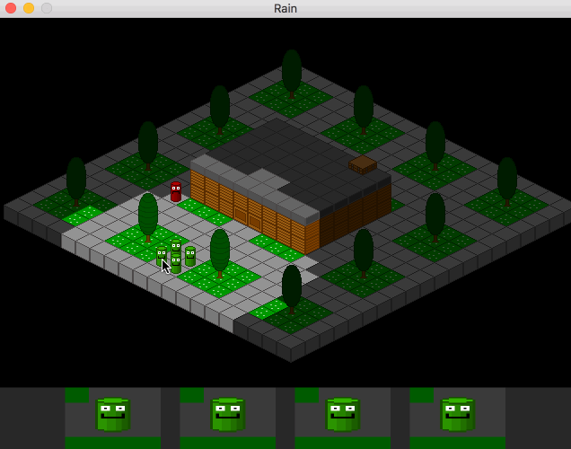

# Rain
An noire isometric strategy game

Rain's build script is currently setup to
build on OSX El Capitan.

* Requires SDL2, SDL2_image, SDL2_mixer, and SDL2_ttf

# Controls
* click to select character and left click to set path destination, or right click on enemies to shoot
* 1, 2, 3 for 1x, 2x, 3x zoom
* q and e to rotate screen
* arrow keys to move camera

